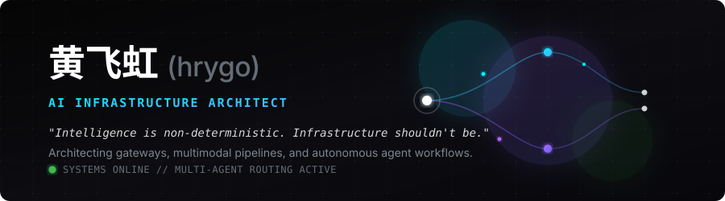

<div align="left">

<picture>
  <source media="(prefers-color-scheme: dark)" srcset="header.svg">
  <source media="(prefers-color-scheme: light)" srcset="header.svg">
  
</picture>

<br/>

I build infra for AI agents — from unified access layers to security shields, from watchdog daemons to content pipelines.

The best tools are invisible. The best agents are trustworthy. I work on both.

---

### `/// BUILDING`

- **⟐** **[HotPlex](https://github.com/hrygo/hotplex)** — Unified access layer for AI Coding Agents. One gateway, every model, zero friction.
- **⬡** **[OpenClaw DevKit](https://github.com/hrygo/openclaw-devkit)** — Containerized development toolkit for the OpenClaw multi-channel AI productivity platform.
- **◒** **[ClawReel](https://github.com/hrygo/clawreel)** — AI short-video automation pipeline. From script to publish, agent-driven with HITL checkpoints.
- **⟁** **[DivineSense](https://github.com/hrygo/divinesense)** — AI-driven personal second brain. Smart agents that automate tasks and filter high-value signals.

<br/>

---

### `/// BUILDED`

<table>
<tr>
<td width="50%" valign="top">

**[HotPlex Legacy](https://github.com/hrygo/hotplex-legacy)** `INFRA`

The predecessor that proved the concept. Archived — spirit lives on in HotPlex.

`Go`

</td>
<td width="50%" valign="top">

**[Security Shield](https://github.com/hrygo/security-shield)** `SECURITY`

Multi-layer defense for OpenClaw agents — prompt injection detection, social engineering resistance, privilege escalation prevention.

`TypeScript`

</td>
</tr>
<tr>
<td width="50%" valign="top">

**[OpenClaw Watchdog](https://github.com/hrygo/openclaw-watchdog)** `RELIABILITY`

Go daemon that monitors gateway health and auto-recovers on failure. Because agents shouldn't go dark.

`Go`

</td>
<td width="50%" valign="top">

**[AI Content Studio](https://github.com/hrygo/ai-content-studio)** `MEDIA`

Transform articles into broadcast-quality podcast audio with multi-character dialogue and high-fidelity TTS.

`Python`

</td>
</tr>
</table>

<br/>

---

### `/// STACK`

<table>
<tr>
<td>

```
LANGUAGES       Go · TypeScript · Python · Shell
DOMAINS         AI Agent Infra · LLM Gateway · DevSecOps · Content Automation
PROTOCOLS       MCP · Agent SDK · OpenAI-compatible API
TOOLS           Claude Code · Docker · GitHub Actions
FOCUS           Agent Harness · Multi-model Routing · Security · Observability
```

</td>
</tr>
</table>

<br/>

---

### `/// METRICS`

<div align="left">


</div>

<div align="center">

<picture>
  <source media="(prefers-color-scheme: dark)" srcset="https://streak-stats.demolab.com?user=hrygo&theme=dark&background=0d1117&border=21262d&ring=58a6ff&fire=3fb950&currStreakLabel=e6edf3&sideLabels=8b949e&dates=484f58&currStreakNum=e6edf3&sideNums=e6edf3">
  <source media="(prefers-color-scheme: light)" srcset="https://streak-stats.demolab.com?user=hrygo&theme=default&background=ffffff&border=d0d7de&ring=58a6ff&fire=3fb950&currStreakLabel=1f2328&sideLabels=656d76&dates=afb8c1&currStreakNum=1f2328&sideNums=1f2328">
  
</picture>

</div>

</div>

<br/>

---

### `/// CONNECT`

<div align="center">

[](https://github.com/hrygo)
&nbsp;&nbsp;

</div>

<br/>

<div align="center">

<sub>

*Build the infra. The agents will follow.*

</sub>

</div>

<br/>

<div align="right">
<sub>


</sub>
</div>
